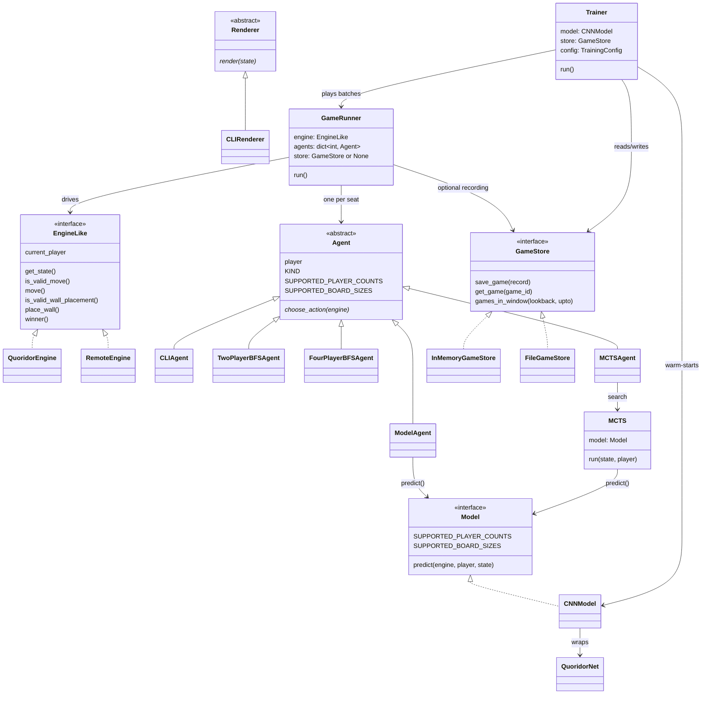
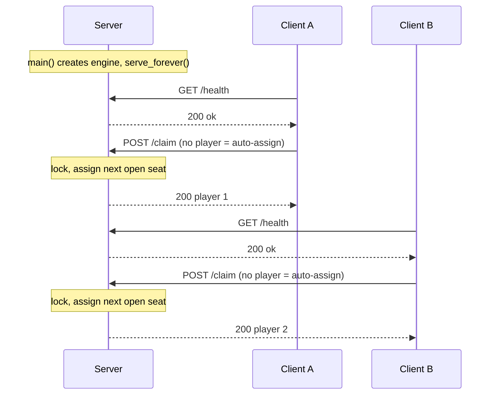
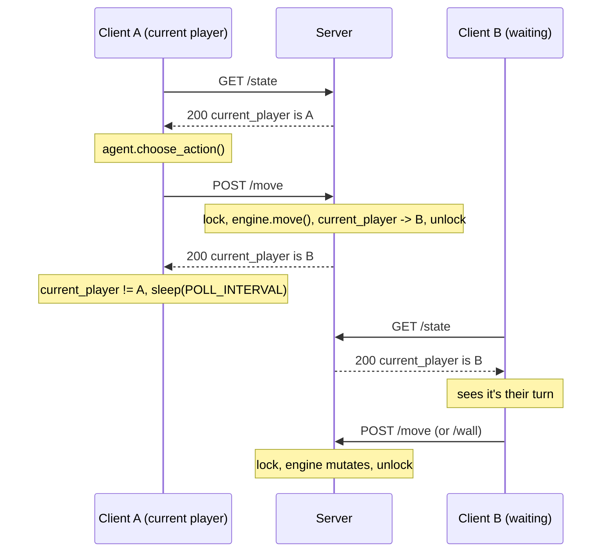
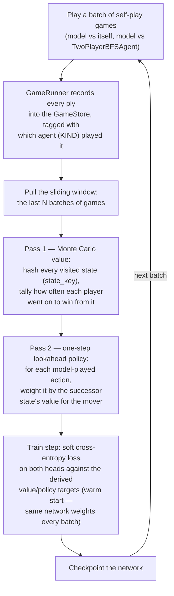

# Quoridor

A from-scratch implementation of [Quoridor](https://quoridorstrats.wordpress.com/beginners-guide-rules-and-basics/),
built layer by layer: board state, then rendering, then rules engine, then a
pluggable player/renderer architecture, then a client-server split so a game
can be played across processes (or containers) instead of just in one.

## Architecture

```
quoridor/
  board.py        QuoridorBoard, BoardState — game state + (de)serialization
  pathfinding.py   is_wall_between, bfs_shortest_path — pure functions, no
                    project imports. The one place "how walls block movement"
                    is implemented; everything else calls into it instead of
                    keeping its own copy of the rule.
  rendering.py      Renderer (ABC) + CLIRenderer — turns a BoardState into a
                     human-facing view. render() is pure: no printing, no I/O.
  engine.py          Direction, WallOrientation, InvalidMoveError,
                       QuoridorEngine (the rules layer), and EngineLike — the
                       Protocol both QuoridorEngine and RemoteEngine satisfy.
  actions.py          MoveAction / WallAction / Action, apply_action(),
                        legal_actions()
  agents.py            Agent (ABC) + CLIAgent (human, via terminal input) +
                         TwoPlayerBFSAgent / FourPlayerBFSAgent (rule-based
                         AI, shallow — always steps along the shortest
                         unobstructed path to its goal, never places walls)
                         + ModelAgent (policy head only) + MCTSAgent (policy
                         + value heads guiding a tree search)
  runner.py             GameRunner — cycles N Agents (2 or 4) against one
                          EngineLike until there's a winner
  server.py              stdlib http.server game server — owns one
                           QuoridorEngine, exposes it over HTTP
  client.py               RemoteEngine — EngineLike implementation that
                            talks to a running server (urllib + json only)
  state_key.py             state_key() — canonical hash of a BoardState +
                             whose turn it is, for anything keyed by "which
                             position is this"
  game_store.py             GameStore (ABC) + InMemoryGameStore /
                              FileGameStore — where recorded games live
  play_local.py            entrypoint: two Agents vs one local engine
  play_remote.py            entrypoint: one Agent vs a remote server
  rl/
    model.py                 Model (ABC), ModelPrediction
    cnn_model.py              CNNModel — Model backed by QuoridorNet
    network.py                 QuoridorNet — the CNN itself (policy + value
                                 heads)
    encoding.py               BoardState <-> tensor conversions, action <->
                                index mapping
    mcts.py                   MCTS — Monte Carlo Tree Search guided by a
                                Model's policy/value predictions
    targets.py                derive_training_targets() — turns recorded
                                games into value/policy training targets
    trainer.py                TrainingConfig, Trainer — the self-play
                                training loop
    train.py                   CLI entrypoint for training
    replay.py                  replay_game() — step through a stored
                                 GameRecord move by move
```

**The key idea:** `Agent`, `Renderer`, `GameRunner`, `play_local.py`, and
`play_remote.py` are all written against `EngineLike`, not against
`QuoridorEngine` directly. `QuoridorEngine` (in-process) and `RemoteEngine`
(talks to a server over HTTP) are two different implementations of that same
interface, so exactly the same `Agent`/`GameRunner` code plays a local game
or a networked one — `tests/test_integration.py` proves this by running the
same `GameRunner` two ways: once against a local engine, once against a real
running server. The same pattern repeats twice more: `ModelAgent`/`MCTSAgent`
are written against `Model`, not against `CNNModel` directly, so a future
non-CNN model plugs in unchanged; and `GameRunner`'s optional recording is
written against `GameStore`, not against any specific storage mechanism, so
swapping `InMemoryGameStore`/`FileGameStore` for a future MongoDB-backed
store touches nothing else.

### Class diagram



`Agent`/`Model`/`Renderer`/`GameStore` are the four swappable-implementation
boundaries in the codebase — everything downstream of each is written
against the abstract type, never a concrete one, which is what lets a local
game, a networked game, and self-play training all reuse the same
`GameRunner`.

## Technical specifications

### Where a game actually starts

- **Local:** `play_local.py:29` builds `QuoridorEngine(QuoridorBoard(...))`,
  then `play_local.py:35-36` hands it to `GameRunner(engine, agents).run()`,
  which loops until there's a winner.
- **Remote:** the server creates the one shared `QuoridorEngine` at
  `server.py:152` inside `main()`, before `serve_forever()`. Each client only
  starts acting once it calls `remote.claim_player(...)`
  (`play_remote.py:32`) and enters its polling loop (`play_remote.py:42`).

### `GameServer` mechanics

`GameServer` (`server.py:20`) subclasses `ThreadingHTTPServer`, so every
incoming request runs on its own thread instead of being handled one at a
time — required here since multiple players poll and act concurrently. All
threads share the single `QuoridorEngine` instance stored on the server, so
`GameServer.lock` (`server.py:27`, a plain `threading.Lock`) guards every
read/write of engine state: each handler wraps its logic in
`with self._server.lock:` before touching `engine`, which prevents two
requests (e.g. two moves) from racing each other.

### Sequence: client connects and claims a seat



### Sequence: one action, through to the next player acting

Nothing is pushed to clients — each `play_remote.py` process polls
`/state` every `POLL_INTERVAL` second (`play_remote.py:42-45`) and only acts
once it sees `current_player` equal to its own seat.



## Rules implemented

- 2-player and 4-player games. In 4-player, seats 1/2 start at the top/bottom
  edge (goal: the opposite row) and seats 3/4 start at the left/right edge
  (goal: the opposite column) — same board, same rules, just more seats.
  Wall counts scale with player count: half the 2-player allowance per seat
  (e.g. 9×9 is 10 walls each for 2 players, 5 each for 4 — matching real
  Quoridor's documented 4-player rule).
- Turn-based pawn movement in the four cardinal directions, blocked by walls,
  board edges, and any other player's pawn.
- Wall placement, validated against: remaining inventory, board bounds,
  overlap with an existing wall, crossing an existing wall, and — the one
  rule that goes beyond bare mechanics — a wall may never fully block *any*
  player's path to their goal (checked via a full-board connected-components
  scan after tentatively placing the wall).
- Win detection when a pawn reaches its goal edge.
- Server-side seat assignment: connecting without specifying a player claims
  the next open seat in connection order; a specific seat can still be
  requested explicitly, and a taken (or, once full, nonexistent) seat is
  rejected either way.

## Training the model

`ModelAgent`/`MCTSAgent` are backed by `CNNModel` — a CNN (`QuoridorNet`)
with a policy head (one weight per possible action) and a value head (one
win-probability per player). Freshly constructed, that network has random
weights; `quoridor.rl.trainer.Trainer` is the naive first training loop that
actually trains it, currently scoped to 5×5, 2-player games (the training
*logic* itself is written generically over `player_count` — only `CNNModel`'s
layer sizes are tied to one board size/player count).

The core idea is self-play plus classical Monte Carlo state-value
estimation, with the policy target derived from those values by one-step
lookahead rather than tracked separately:



A few choices worth calling out:

- **Why derive the policy from values instead of tracking per-action win
  rates directly**: state visits are far more common than any single
  (state, action) pair, so bootstrapping the policy target off the
  richer, better-sampled value estimates avoids fragmenting an already
  sparse signal.
- **Why only `"model"`-played actions feed the policy target**:
  `TwoPlayerBFSAgent` never places walls, so folding its plies into the
  policy target would teach "never place a wall here" purely because the
  baseline doesn't know how to, not because it's actually bad. Every ply
  (model or BFS) still counts toward the *value* target — a real win or
  loss is meaningful regardless of who was playing.
- **Exploration**: self-play uses temperature-based sampling
  (`ModelAgent(..., temperature=...)`, `policy ** (1/temperature)`), not
  epsilon-greedy — a tunable knob (`TrainingConfig.exploration_temperature`)
  separate from the one that sharpens the policy *target* during
  derivation (`policy_temperature`).
- **Storage is decoupled from both game execution and training**:
  `GameRunner` (the same runner `play_local.py`/`play_remote.py` use) can
  optionally record into any `GameStore` — training self-play is just a
  regular game with recording turned on, not a separate code path. The
  store itself is swappable (`InMemoryGameStore`/`FileGameStore` today, a
  MongoDB-backed one later) without touching `GameRunner` or `Trainer`.
- **Batch size, lookback window, and number of batches are all
  `TrainingConfig` fields** — meant to scale from a couple of test games up
  toward the ~1M-game range without any code changes.

## Not implemented yet

- Diagonal moves / jumping over an adjacent opponent pawn.
- A real GUI (`CLIRenderer` is the only `Renderer` so far — the `Renderer`
  base class exists specifically so a GUI can be added as a second
  implementation without touching `Agent`/`GameRunner`/the engine).
- MCTS-guided self-play during training (`Trainer` currently generates data
  via plain `ModelAgent`/`TwoPlayerBFSAgent` play, not `MCTSAgent` — MCTS is
  wired up and usable for actual play, just not yet used to *generate*
  training data, mainly for self-play speed).
- Training at real scale (only ever run with a handful of games so far;
  1k-plus-game batches, many batches, and evaluating whether the model
  actually improves over a longer run are all still open).
- 4-player / larger-board training (the training logic is written
  generically over `player_count`, but `CNNModel`'s dimensions are fixed
  per instance, so a 4-player or 9×9 model would need its own training run).

## Requirements

- Python 3.13+ (containers pin `python:3.13-slim`; local dev works from 3.11+)
- No external runtime dependencies — the game, server, and client are all
  pure standard library (`http.server`, `urllib`, `json`). `make` sets up an
  isolated `.venv` for the dev tools only (pytest, mypy, ruff), since this
  system's Python is externally managed and won't allow global `pip install`.
- Docker + Docker Compose, if you want to run the containerized version.

## Usage

```bash
make install            # create .venv and install dev dependencies
make test                # run the pytest suite
make typecheck           # run mypy in strict mode
make lint                # run ruff
make check               # lint + typecheck + test — run this before committing
make run-local           # play a local game (human vs bfs by default)
make run-server          # start the HTTP game server on :8765
make run-client-human    # connect a human player to a running server
make run-client-bfs      # connect a BFS AI player to a running server
make docker-build        # build the server/client images
make docker-up           # start server + AI client in Docker
make docker-down         # stop and remove the Docker stack
make clean               # remove the venv and all caches
```

Run `make help` to see this list from the terminal.

### Playing locally, without a server

```bash
python -m quoridor.play_local --players 4 --agents human bfs bfs bfs --size 9
```

`--players` is `2` or `4` (default 2); `--agents` takes one `human`/`bfs`
token per seat (default `human bfs`). A human turn shows the board and
prompts for a command: `move <up|down|left|right>` or `wall <h|v> <row> <col>`.

### Playing over the network, without Docker

```bash
python -m quoridor.server --port 8765 --size 9 --players 4   # terminal 1
python -m quoridor.play_remote --url http://localhost:8765 --agent human   # terminal 2
python -m quoridor.play_remote --url http://localhost:8765 --agent bfs     # terminal 3
python -m quoridor.play_remote --url http://localhost:8765 --agent bfs     # terminal 4
python -m quoridor.play_remote --url http://localhost:8765 --agent bfs     # terminal 5
```

Each `play_remote` process claims one seat and only acts for it — polling
the server and waiting until it's that seat's turn. Omit `--player` (as
above) to auto-assign the next open seat in connection order, or pass
`--player N` to claim a specific one explicitly; either way the process
prints which seat it ended up with. A game needs every configured seat
filled by an active client to make progress — the server has no game loop of
its own, it's purely reactive, so an empty seat just means the game stalls
on that player's turn until someone connects for it.

### Playing in Docker

```bash
docker compose build
docker compose up -d server ai-client-1 ai-client-2 ai-client-3   # server + 3 AI seats
docker compose run --rm cli-client                                # attach as the human
```

The default `docker-compose.yml` is a 4-player game: the server runs with
`--players 4`, and none of the four client services pass `--player` — seats
auto-assign, so whichever container connects first becomes seat 1, and so
on (the `ai-client-N` names are just Compose service identifiers, not fixed
game seats). `cli-client` isn't started by plain `up` on purpose — Compose
doesn't attach a TTY well to one service among several, so the interactive
human is run separately with `run --rm` instead. `RemoteEngine` retries
against `/health` on startup, so client containers don't need to race the
server's boot time.

## Type checking

Game code (everything under `quoridor/`) is fully type-hinted and checked
with `mypy --strict`, including a `Protocol`-based static check
(`quoridor/client.py`, under `if TYPE_CHECKING:`) that both `QuoridorEngine`
and `RemoteEngine` genuinely satisfy `EngineLike` — not just "probably do".

This strictness is a direct response to a real bug hit early on:
`QuoridorBoard.from_dict` was reassigning `h_walls`/`v_walls` (declared as
`set[tuple[int, int]]`) straight from JSON-shaped lists, so a restored board
silently carried lists where the rest of the code expected sets. The fix was
twofold — correct the bug, and make it structurally impossible to
reintroduce quietly: `to_dict`/`from_dict` go through an explicit
`BoardState` `TypedDict` instead of an untyped `dict`, and `from_dict`
assigns each field explicitly (no generic `setattr` loop) so mypy can catch
a type mismatch on that boundary. `make check` runs `mypy` on every change.

Test files under `tests/` are exempted from mypy's "must annotate every def"
rule (conventional for pytest-style tests) but still get everything else
strict mode checks.

## Tests

`tests/` (pytest, run via `make test`) covers every layer:

- `test_board.py`, `test_pathfinding.py` — state serialization, movement/BFS
  rules in isolation.
- `test_engine.py` — the same wall-blocking rules exercised through
  `QuoridorEngine`, proving it wires the shared `pathfinding` functions in
  correctly (deliberately overlapping with `test_pathfinding.py`, not
  redundant — one proves the rule, the other proves the wiring).
- `test_rendering.py`, `test_agents.py`, `test_runner.py` — the renderer,
  both `Agent` implementations (including `CLIAgent`'s input re-prompt loop
  via a monkeypatched `input()`), and `GameRunner`.
- `test_server.py` — every HTTP route against a real `ThreadingHTTPServer`
  spun up on an ephemeral port per test.
- `test_integration.py` — full BFS-agent-only games (both 2-player and
  4-player) driven through `GameRunner` + `RemoteEngine` against a real
  running server, plus direct checks that a `409` response becomes a local
  `InvalidMoveError`/`SeatTakenError` as appropriate.
- `test_rl_encoding.py`, `test_rl_model.py`, `test_rl_mcts.py` — state/action
  <-> tensor conversions, `CNNModel`'s `Model` contract, and MCTS search.
- `test_state_key.py`, `test_game_store.py` — hashing is order-independent
  and sensitive to whose turn it is; both `GameStore` backends round-trip a
  `GameRecord` and filter correctly by lookback window.
- `test_rl_targets.py` — Monte Carlo value + one-step-lookahead policy
  derivation: a normal two-ply win, the terminal-move edge case, the
  zero-sum-weights fallback, and that winnerless (cutoff) games are excluded.
- `test_rl_trainer.py` — a full tiny training run end to end (self-play,
  target derivation, a training step) against both store backends, asserting
  it completes with a finite loss.
